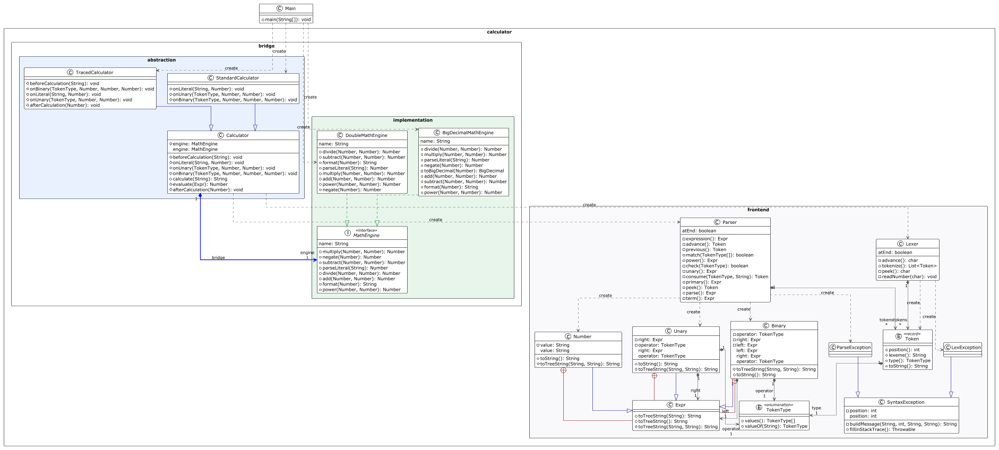

# AST Calculator — Bridge Design Pattern


-blue.svg)


An arithmetic expression calculator with a genuine compiler front-end (**Lexer $\rightarrow$ Recursive Descent Parser $\rightarrow$ Abstract Syntax Tree**) whose evaluation engine is decoupled using the **Gang of Four (GoF) Bridge Pattern**.

---

## 1. Project Overview

Most classic demonstrations of the Bridge pattern rely on textbook examples like *Shapes & Renderers* or *Remotes & Devices*. This project implements an original, domain-rich architecture:

* **Compiler Front-End:** Tokenizes raw mathematical strings into a stream of records, enforces formal context-free grammar, provides pinpoint character-level syntax error reporting, and produces a type-safe Abstract Syntax Tree (`Expr`).
* **The Bridge Pattern:** Decouples **high-level AST evaluation and execution observation** (`Calculator` abstraction) from the **underlying numeric representation and arithmetic computation** (`MathEngine` implementor).

---

## 2. Technical Requirements Mapping

This implementation maps directly to the technical requirements specified for the Bridge pattern:

| Bridge Component           | Class / Interface            | Responsibility                                                                                                                             |
|:---------------------------|:-----------------------------|:-------------------------------------------------------------------------------------------------------------------------------------------|
| **Abstraction**            | `abstract class Calculator`  | Holds a protected reference to `MathEngine`. Orchestrates lexing, parsing, and post-order AST evaluation via template hooks.               |
| **Refined Abstraction 1**  | `class StandardCalculator`   | Evaluates expressions silently and returns the final computed string result.                                                               |
| **Refined Abstraction 2**  | `class TracedCalculator`     | Evaluates expressions while recording and printing every intermediate reduction step (execution tracing).                                  |
| **Implementor**            | `interface MathEngine`       | Declares primitive low-level arithmetic operations (`add`, `subtract`, `multiply`, `divide`, `power`, `negate`, `parseLiteral`, `format`). |
| **Concrete Implementor 1** | `class DoubleMathEngine`     | Implements fast, hardware-accelerated 64-bit IEEE-754 floating-point arithmetic (`double`).                                                |
| **Concrete Implementor 2** | `class BigDecimalMathEngine` | Implements exact, arbitrary-precision decimal arithmetic using `java.math.BigDecimal` and `MathContext`.                                   |
| **Client**                 | `class Main`                 | Composes abstractions with implementors at runtime and demonstrates switching engines on the fly without changing the abstraction.         |

---

## 3. Formal Grammar & Compiler Front-End

The parser implements a **Deterministic Recursive Descent Parser** adhering to the following Context-Free Grammar (CFG) in Extended Backus-Naur Form (EBNF):

### EBNF Grammar Specification
```ebnf
expression ::= term ( ( "+" | "-" ) term )*
term       ::= power ( ( "*" | "/" ) power )*
power      ::= unary ( "^" power )?              (* Right-associative exponentiation *)
unary      ::= "-" unary | primary               (* Prefix negation *)
primary    ::= NUMBER | "(" expression ")"
NUMBER     ::= [0-9]+ ( "." [0-9]+ )?
```

### Operator Precedence & Associativity

| Precedence Level |    Operators    | Description                             | Associativity | Grammar Method |
|:----------------:|:---------------:|:----------------------------------------|:-------------:|:---------------|
| **1 (Highest)**  | Literals, `( )` | Numbers and explicit groupings          |      N/A      | `primary()`    |
|      **2**       |       `-`       | Unary negation (e.g. `- -5`)            | Right-to-Left | `unary()`      |
|      **3**       |       `^`       | Exponentiation (e.g. `2 ^ 3 ^ 2 = 512`) | Right-to-Left | `power()`      |
|      **4**       |    `*`, `/`     | Multiplicative operations               | Left-to-Right | `term()`       |
|  **5 (Lowest)**  |    `+`, `-`     | Additive operations                     | Left-to-Right | `expression()` |

### Error Diagnostics
When invalid syntax or unexpected tokens are encountered, the compiler front-end generates compiler-grade visual diagnostics with exact position indicators:

```text
  3 + * 4
      ^
Parse Error: Expected number or '(' but found: '*'
```

### Error Diagnostics
When invalid syntax or unexpected tokens are encountered, the compiler front-end generates compiler-grade visual diagnostics with exact position indicators:

```text
  3 + * 4
      ^
Parse Error: Expected number or '(' but found: '*'
```

---

## 4. Architecture & UML Diagram

```
                             THE BRIDGE
  [ Abstraction Hierarchy ]              [ Implementor Hierarchy ]
        Calculator  ────────(bridge)────────►  MathEngine
            ▲                                      ▲
            │                                      │
     ┌──────┴─────────────┐                 ┌──────┴────────────────┐
     │                    │                 │                       │
StandardCalculator  TracedCalculator  DoubleMathEngine  BigDecimalMathEngine
```

### Complete Class Diagram


---

## 5. Five Clean Code Principles (Justifications)

1. **Clear Separation of Abstraction vs. Implementor (Information Hiding):**
   * The abstraction layer (`Calculator`) only knows the high-level tree traversal algorithm. It never depends on `double` or `BigDecimal`.
   * Low-level details (such as `MathContext` or IEEE-754 bit representations) remain strictly encapsulated inside the concrete implementors.
2. **Open/Closed Principle (OCP):**
   * The architecture is open for extension but closed for modification. Adding a new `FractionMathEngine` (for exact rational math $1/3$) requires creating **one** class implementing `MathEngine`.
   * Zero lines of code in `Lexer`, `Parser`, `Expr`, or `Calculator` need to be modified.
3. **Single Responsibility Principle (SRP):**
   * `Lexer`: Scans raw characters into token records.
   * `Parser`: Enforces grammar rules and constructs the syntax tree.
   * `Calculator`: Coordinates the evaluation pipeline and output presentation.
   * `MathEngine`: Computes mathematical operations.
4. **Don't Repeat Yourself (DRY) via the Template Method Pattern:**
   * Recursive tree evaluation logic is written **once** in `Calculator.evaluate(Expr)`.
   * Refined abstractions (`StandardCalculator` and `TracedCalculator`) do not duplicate AST traversal; they only implement lightweight hook methods (`onLiteral`, `onBinary`, `onUnary`).
5. **Preserving Domain Precision at Architectural Boundaries:**
   * `Expr.Number` stores its numeric value as a raw `String literal` rather than immediately parsing it to a `double`.
   * This prevents premature precision loss (e.g. `"0.1"` becoming `0.10000000000000000555...` due to binary float rounding) before the `BigDecimalMathEngine` has a chance to parse it.

---

## 6. Project Structure

```text
src/
└── calculator/
    ├── Main.java                          # Client application demonstrating runtime switching
    │
    ├── frontend/                          # Compiler Front-End
    │   ├── TokenType.java                 # Enum representing token categories
    │   ├── Token.java                     # Record holding token type, lexeme, and source cursor position
    │   ├── Lexer.java                     # Cursor-based lexical scanner
    │   ├── Parser.java                    # Recursive descent parser
    │   ├── Expr.java                      # AST Node hierarchy (Number, Binary, Unary)
    │   ├── SyntaxException.java           # Base exception formatting visual caret error markers
    │   ├── LexException.java              # Scanner-level error (unexpected characters)
    │   └── ParseException.java            # Grammar/token error (unexpected tokens)
    │
    └── bridge/                            # The Bridge Pattern
        ├── abstraction/                   # Abstraction Side
        │   ├── Calculator.java            # Base abstraction (orchestrates parsing & evaluation)
        │   ├── StandardCalculator.java    # Refined Abstraction 1 (silent calculation)
        │   └── TracedCalculator.java      # Refined Abstraction 2 (step-by-step trace)
        │
        └── implementation/                # Implementation Side
            ├── MathEngine.java            # Implementor interface
            ├── DoubleMathEngine.java      # Concrete Implementor 1 (IEEE-754 64-bit float)
            └── BigDecimalMathEngine.java  # Concrete Implementor 2 (Arbitrary precision)
```

---

## 7. Build and Run

### Prerequisites
* Java JDK 21 or higher.

### Compile
From the `src` directory:
```bash
javac calculator/Main.java calculator/frontend/*.java calculator/bridge/abstraction/*.java calculator/bridge/implementation/*.java
```

### Run
```bash
java calculator.Main
```

---

## 8. Sample Execution Output

```text
==================================================
   SOFTWARE DESIGN PATTERNS - BRIDGE PATTERN DEMO 
==================================================

--- DEMO 1: Runtime Implementor Switching ---
Evaluating: 0.1 + 0.2
Using: IEEE-754 64-bit Double Engine
Result -> 0.30000000000000004

>> [RUNTIME SWAP] Switching engine to BigDecimalMathEngine  0.3

--- DEMO 2: Refined Abstraction (Step-by-Step Trace) ---
==================================================
Tracing Expression: 3 + 4 * (2 - 1) ^ 3
Active Backend:     Arbitrary-Precision BigDecimal Engine (40 digits)
--------------------------------------------------
  Step 01: [LITERAL] Read '3' -> 3
  Step 02: [LITERAL] Read '4' -> 4
  Step 03: [LITERAL] Read '2' -> 2
  Step 04: [LITERAL] Read '1' -> 1
  Step 05: [BINARY]  2 MINUS 1 = 1
  Step 06: [LITERAL] Read '3' -> 3
  Step 07: [BINARY]  1 CARET 3 = 1
  Step 08: [BINARY]  4 STAR 1 = 4
  Step 09: [BINARY]  3 PLUS 4 = 7
--------------------------------------------------
Final Result: 7
==================================================

==================================================
Tracing Expression: 10 / 3
Active Backend:     IEEE-754 64-bit Double Engine
--------------------------------------------------
  Step 01: [LITERAL] Read '10' -> 10.0
  Step 02: [LITERAL] Read '3' -> 3.0
  Step 03: [BINARY]  10.0 SLASH 3.0 = 3.3333333333333335
--------------------------------------------------
Final Result: 3.3333333333333335
==================================================
```